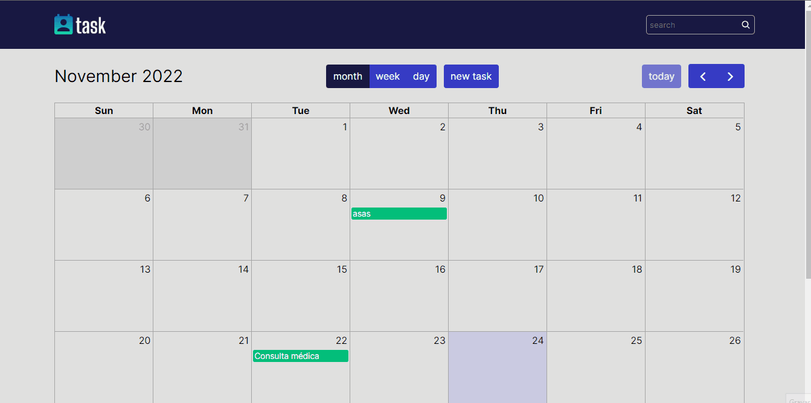

<h1 align="center"> Calendario de Tarefas </h1>

<p>
   Calendário de tarefas desenvolvido em React.Js no Frontend e Backend desenvolvido com Node.Js seguindo a arquitetura REST com integração ao banco de dados MongoDB.
</P>

<p align="center">
   <a href="#funcionalidades">Funcionalidades</a> •
   <a href="#tecnologias">Tecnologias</a> •
   <a href="#testando">Testando</a> •
   <a href="#autor">Autor</a> 
</p>

## Funcionalidades

- [x] Criar uma nova tarefa em uma data específica
- [x] Criar nova tarefa em um período de datas.
- [x] Ver, editar e deletar uma tafera.
- [x] visualzação do calendário por mês, semana ou dia.
- [ ] Pesquisar tarefa.

## Tecnologias
Foram usadas as seguintes tecnologias para o projeto:

- Back End
   - [Node.js](https://nodejs.org/en/)
   - [Express](https://expressjs.com/pt-br/)
   - [Nodemon](https://nodemon.io/)
   - [Mongodb](https://www.mongodb.com/home)
   - [Uuid](https://www.npmjs.com/package/uuid)
- Front End
   - [React.js](https://pt-br.reactjs.org/)
   - [Styled-Components](https://styled-components.com)
   - [FullCalendar](https://fullcalendar.io/)
   - [Swr](https://swr.vercel.app/pt-BR)

## Preview



## Testando
**Pré-requisitos:** <br>
Antes de começar, você vai precisar ter instalado em sua máquina as seguintes ferramentas: [Git](https://git-scm.com), [Node.js](https://nodejs.org/en/).<br>
Além disto é bom ter um editor para trabalhar com o código, como o [VSCode](https://code.visualstudio.com).

#### Rodando o Back End
```bash
   # Acesse a pasta Back-End e renomeie o arquivo 
   '.env.example' para '.env'

   # Atribua a url da database à variavel "DATABASE_URL"
   DATABASE_URL = "url"

   # Se você não tiver a url da database, 
   # entre em contato com o autor ^^.
```

```bash
   # Acesse a pasta do projeto no terminal/cmd
   $ cd '.\Calendário de tarefas\Back-End\'

   # Instale as dependências
   $ yarn

   #Execute a aplicação em modo de desenvolvimento
   $ yarn dev
```

#### Rodando o Front End
```bash
   # Acesse a pasta do projeto no terminal/cmd
   $ cd '.\Calendário de tarefas\Front-End\web\'

   # Instale as dependências
   $ yarn

   #Execute a aplicação em modo de desenvolvimento
   $ yarn start
```

## Autor

Developed with 💛 by [elmojr](https://elmojr.tech)
